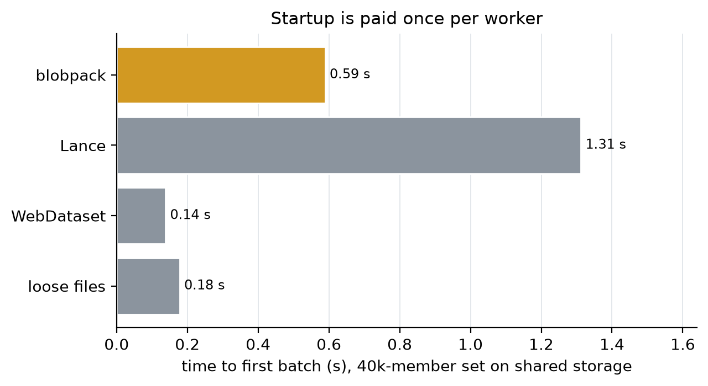

# Benchmarks

Measurements behind the numbers quoted in the top-level README. Real data,
two blob-size regimes, two filesystems:

- **coco_images**: [COCO train2017](https://cocodataset.org/#download),
  all 118,287 JPEGs, 19.3 GB, avg 163 KB per blob
- **pusht_frames**: [LeRobot PushT](https://huggingface.co/datasets/lerobot/pusht),
  every frame as a 96x96 JPEG, 25,650 blobs, avg 1.3 KB
- filesystems: a shared CephFS filesystem on a GPU cluster, and node-local
  NVMe (`/tmp`); one 16-core node, Python 3.14

Formats compared: loose files, Blob Pack (STORED zip shards, 512 MiB
target), uncompressed tar (with and without an external offset index),
DEFLATE zip, bytes embedded in Parquet (1,000-row groups, uncompressed),
and Lance 10.0 (inline `large_binary` and blob storage class).

Benchmark-only dependencies install with `uv sync --group bench`. Note on
provenance fields: results committed before the identity scrub carry
`work_dir`/`node`; re-runs emit a `storage` class (`local`/`shared`)
instead, so freshly produced files differ from the committed ones in those
fields only.

## Files

| file | contents |
|---|---|
| `bench.py` | main matrix: build costs, storage/inodes, sequential and epoch reads, random access (1/8 threads), decode, folder ops, shard-size sweep, Parquet and Lance baselines |
| `bench_fix.py` | follow-ups: corrected STORED-vs-DEFLATE build, the pread fast path measured on unchanged shards, archive-open cost vs member count, threaded Lance blob consumer |
| `bench_nvme_pread.py` | pread vs stock `zipfile` on node-local NVMe, median of 5 |
| `bench_dataloader.py` | torch DataLoader end to end: startup and steady throughput against loose files, WebDataset and Lance |
| `bench_audio.py` | small-blob storage and read costs on speech audio |
| `appendix_video.py` | per-frame JPEGs vs MP4 container (GOP 30/300) on PushT episodes |
| `results/*.json` | raw outputs of the runs quoted everywhere |

## Headline results (cold, per blob where applicable)

Sequential file-order read of the same 4.3 GB / 26,304-item sample, coco,
shared FS: loose 44 MB/s, pack 734 MB/s, tar 734 MB/s, parquet 487 MB/s,
lance 321 MB/s. For 1.3 KB blobs the loose-vs-pack gap grows to 311x, and
creating the 25,650 loose files cost 3,118 s on the shared FS vs 4 s on
NVMe. Folder-operation ratios extrapolate loose from a 20,000-file subset.

Random access, coco:

| reader | shared FS | NVMe |
|---|---|---|
| loose files, 8 threads | 0.49 ms | 0.08 ms |
| pack, stock `zipfile`, 8 threads | 2.25 ms | 0.74 ms |
| pack, pread fast path, 8 threads | 0.60 ms | 0.035 ms |
| tar + offset index, 8 threads | 0.95 ms | 0.06 ms |
| Parquet embedded, per call | 217 ms | 171 ms |
| Lance, batched take | 1.19 ms | 0.31-0.54 ms |

Other findings: DEFLATE on JPEGs recovered 0.65% of bytes for 55% more
build time; shard sizes 64 MiB-2 GiB were performance-neutral; warm archive
open costs ~1.8 us per member (cache handles); a short-GOP MP4 was 7.6x
smaller than per-frame JPEGs at near-equal sequential decode speed, 64x
slower on single-frame access.

## Training-loader benchmark (`bench_dataloader.py`)

What a training job actually feels, rather than raw file reads: a torch
DataLoader with persistent workers decoding every JPEG. Startup and
throughput are reported separately, because a format's opening cost is
paid once and must not be read as slow reading.

- **time to first batch**: opening the format, paid once per worker
- **steady samples/s**: sustained rate on a second pass, workers already alive

COCO train2017, 40,000 images (6.5 GB), batch 32, median of 3; time to
first batch at 8 workers. Python 3.14 with DataLoader workers started by
`fork` (3.14's default, `forkserver`, re-imports torch in every worker and
adds about 1 s to every case's first batch).

**Shared filesystem (CephFS)**

| case | TTFB | 1 worker | 4 workers | 8 workers |
|---|---|---|---|---|
| loose files | 0.18 s | 298 | 1166 | 1808 |
| blobpack | 0.59 s | 520 | 2062 | 3973 |
| blobpack, `validate_on_open=True` | 11.3 s | 522 | 2082 | **4169** |
| Lance | 1.31 s | 382 | 1533 | 2885 |
| WebDataset (streaming) | 0.14 s | 511 | 2040 | 3954 |
| blobpack streaming | 0.37 s | 524 | 2097 | **4069** |

**Node-local NVMe**

| case | TTFB | 1 worker | 4 workers | 8 workers |
|---|---|---|---|---|
| loose files | 0.12 s | 492 | 1960 | 3463 |
| blobpack | 0.28 s | 492 | 1950 | 3571 |
| blobpack, `validate_on_open=True` | 3.42 s | 498 | 1981 | **3681** |
| Lance | 0.94 s | 365 | 1546 | 2779 |
| WebDataset (streaming) | 0.12 s | 513 | 2047 | 3954 |
| blobpack streaming | 0.27 s | 526 | 2095 | **3993** |



Reading these:

- On shared storage blobpack sustains **2.2x** loose files for random access
  and edges past WebDataset for streaming; on local NVMe everything except
  Lance converges, because JPEG decoding becomes the bottleneck.
- Validating members on first read removes most of the startup (11.3 s to
  0.59 s on CephFS, 3.4 s to 0.28 s on NVMe). Steady random access stays
  within 5% of validating at open: a member's first read in each worker
  also reads its local header.
- Startup scales with member count, so it matters for short-lived processes
  and very large sets, and amortizes to nothing across a long run with
  persistent workers.

## Audio benchmark (`bench_audio.py`)

LibriSpeech dev-clean, 2,703 FLAC utterances, mean 133 KB, on CephFS:

| | loose files | blobpack | uncompressed tar |
|---|---|---|---|
| storage vs payload | +0.2% | +0.1% | +1.4% |
| inodes | 2,841 | 2 | 2 |
| full sequential pass (cold) | 5.67 s | 0.26 s | 0.30 s |
| random read, 8 threads | 0.318 ms | 0.317 ms | not addressable |
| decode 500 clips | 1.44 s | 0.71 s | - |
| relocate (rsync) | 4.92 s | 1.32 s | - |

Speech corpora are the small-blob regime at production scale (millions of
utterances); this corpus is small enough that the file-count effects are
directional rather than a scaling measurement. Uncompressed tar is as fast
on the pure sequential pass and cannot address a single utterance without a
side index, which is the trade it makes.

A measurement pitfall this run surfaced, now guarded in both harnesses:
`fadvise(DONTNEED)` cannot drop dirty pages, so a pass measured seconds
after building its files reads this process's own page cache at memory
speed while claiming to be cold (0.11 s instead of 5.07 s). Eviction is
now preceded by `sync`, per-pass values are recorded alongside the
median, and figures use the first fully cold pass.

## Caveats

- Absolute rates differ between runs on a shared cluster; compare within a
  table, not across them. Earlier runs of the same matrix are kept as
  `results/v1_*.json` and `results/v2_*.json`, together with the
  measurement changes that produced them.
- v1 charged each format's index build to a short measurement window with
  non-persistent workers, which made blobpack look ~5x slower than
  WebDataset at streaming. That was the benchmark's configuration, not the
  formats: with workers persistent and startup reported separately, the
  ordering reverses.
- Decode work is included deliberately. Excluding it would overstate every
  storage difference, since decoding dominates on fast local storage.

## Reproducing

```
# sources/: train2017.zip, the lerobot/pusht snapshot, LibriSpeech dev-clean
BENCH_TARGETS=sharedfs=./data,local=/tmp/blobpack-bench python bench.py
BENCH_DIR=. python bench_fix.py
python bench_nvme_pread.py --source-zip sources/train2017.zip \
  --work-dir /tmp/bp-nvme --output results/nvme_pread_results.json
python appendix_video.py

python bench_dataloader.py --source-zip sources/train2017.zip \
  --work-dir /tmp/bp-dl --output results/dataloader_local.json \
  --images 40000 --samples 8000 --workers 1 4 8 --repeats 3
python bench_audio.py --src sources/LibriSpeech \
  --work-dir /tmp/bp-audio --output results/audio_local.json
```

The loader benchmark needs `torch`, `opencv-python-headless`, `pylance` and
`pyarrow`; the audio benchmark needs `soundfile`. Each loader measurement
runs in its own subprocess under `--cell-timeout`, so a crashing or hanging
combination costs one cell instead of the run.
